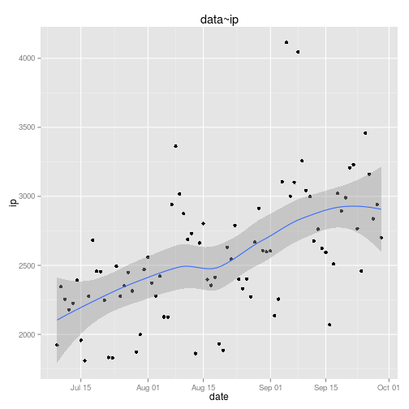
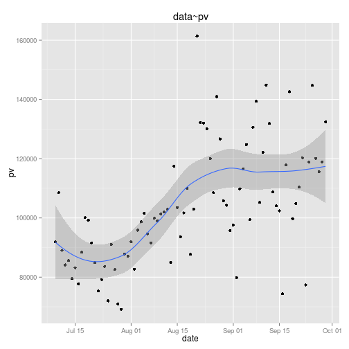
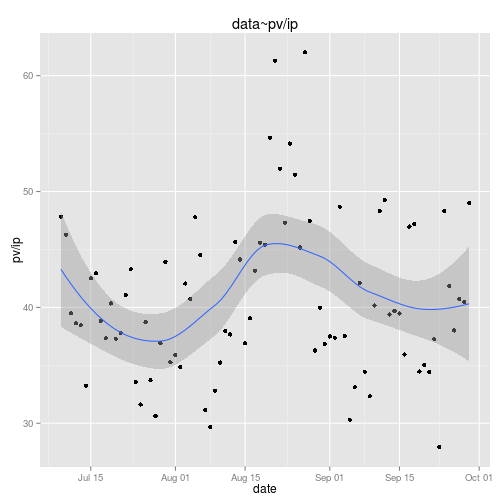
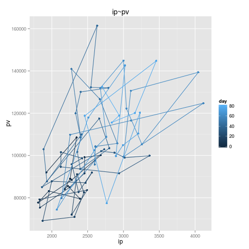

```r
## input data
data0 <- readLines("lesson8.txt")
n <- length(data0)
data1 <- data.frame(date = data0[seq(1, n, 3)], ip = as.numeric(data0[seq(2, 
    n, 3)]), pv = as.numeric(data0[seq(3, n, 3)]))
# transform time format
Sys.setlocale("LC_TIME", "C")
```

```
## [1] "C"
```

```r
data1$date <- sub(pattern = "HKT ", replacement = "", data1$date)
data1$date <- as.POSIXlt(strptime(data1$date, "%a %b %e %H:%M:%S %Y"))

# load library
library(ggplot2)
# plot data ~ ip
qplot(date, ip, data = data1, geom = c("point", "smooth"), main = "data~ip")
```

```
## geom_smooth: method="auto" and size of largest group is <1000, so using loess. Use 'method = x' to change the smoothing method.
```

 

```r
# plot data ~ pv
qplot(date, pv, data = data1, geom = c("point", "smooth"), main = "data~pv")
```

```
## geom_smooth: method="auto" and size of largest group is <1000, so using loess. Use 'method = x' to change the smoothing method.
```

 

```r
# plot data ~ pv per ip
qplot(date, pv/ip, data = data1, geom = c("point", "smooth"), main = "data~pv/ip")
```

```
## geom_smooth: method="auto" and size of largest group is <1000, so using loess. Use 'method = x' to change the smoothing method.
```

 

```r
# plot the path of pi~pv by time
order_time <- order(data1$date)
data2 <- data1[order_time, ]
min <- data2$date[which.min(as.numeric(data2$date))]
date_diff <- data2$date - min
units(date_diff) <- "days"
data2$day <- as.numeric(date_diff)
qplot(ip, pv, data = data2, geom = c("point", "path"), color = day, main = "ip~pv")
```

 


