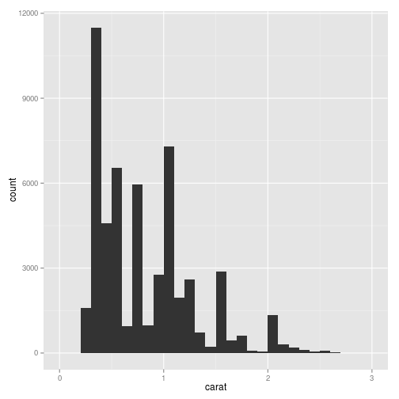

# ggplot 课程
## 1 ggplot2 basic elements
### point of view

a sattistical graphic is a mapping from data to aesthetic attributes (colours, shape, size) of geometric object(points, lines, bars)
### basic elements
1. Data
2. mapping
3. Scale
4. Geometric
5. Statistics
6. Coordinate
7. Layer
8. Facet

## 2 use qplot
### mapping variable to aesthetic attribues

```r
library(ggplot2)
set.seed(1410)  # Make the sample reproducible
dsmall <- diamonds[sample(nrow(diamonds), 100), ]
qplot(carat, price, data = dsmall, colour = color)
```

 

```r
qplot(carat, price, data = dsmall, shape = cut)
```

 

```r
qplot(carat, price, data = diamonds, alpha = I(1/10))
```

 


### use geometric to get figure
+ geom = “point”,画散点图,当提供x,y时为缺省选项
+ geom = “smooth”,画平滑曲线及标准误
+ geom = “boxplot”,画箱线图
+ geom = “path” 或geom = “line”,画连线
+ geom = “histogram”,画直方图,当只提供x时为缺省选项
+ geom =“freqpoly”,画频率多边形
+ geom = “density”,画密度曲线
+ geom = “bar”,画柱形图
+ geom =“jitter”,绘制柱状散点图


```r
qplot(carat, price, data = dsmall, geom = c("point", "smooth"))
```

```
## geom_smooth: method="auto" and size of largest group is <1000, so using loess. Use 'method = x' to change the smoothing method.
```

 


#### span 多项式拟合

method='loess'
弯曲程度取决于span，span越小越弯曲

```r
qplot(carat, price, data = dsmall, geom = c("point", "smooth"), span = 0.2)
```

```
## geom_smooth: method="auto" and size of largest group is <1000, so using loess. Use 'method = x' to change the smoothing method.
```

 

#### GAM ？？


```r
qplot(carat, price, data = dsmall, geom = c("point", "smooth"), method = "gam", 
    formula = y ~ s(x, bs = "cs"))
```

 

####设置直方图区间 binwidth + xlim


```r
qplot(carat, data = diamonds, geom = "histogram", binwidth = 0.1, xlim = c(0, 
    3))
```

 

#### 按color 分类对carat 求和


```r
qplot(color, data = diamonds, geom = "bar", weight = carat) + scale_y_continuous("carat")
```

 

### 时间序列
1. 路径图


```r
year <- function(x) as.POSIXlt(x)$year + 1900
qplot(unemploy/pop, uempmed, data = economics, geom = c("point", "path"))
```

 

彩色路径图


```r
qplot(unemploy/pop, uempmed, data = economics, geom = "path", colour = year(date)) + 
    scale_area()
```

```
## scale_area is deprecated. Use scale_size_area instead.
##   Note that the behavior of scale_size_area is slightly different:
##   by default it makes the area proportional to the numeric value. (Deprecated; last used in version 0.9.2)
```

 


2. 时间趋势图


```r
qplot(date, unemploy/pop, data = economics, geom = "line")
```

 


### use facet to plot by group

```r
qplot(carat, data = diamonds, facets = color ~ ., geom = "histogram", binwidth = 0.1, 
    xlim = c(0, 3))
```

 


### some basic choose
1. main, xlab and ylab
2. xlim, ylim
3. log: choose logistic transform applied to data

## 3 Q
the usage of I()
how to use multi facet


