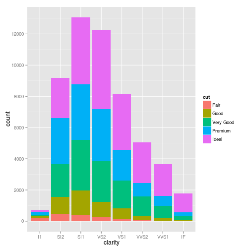
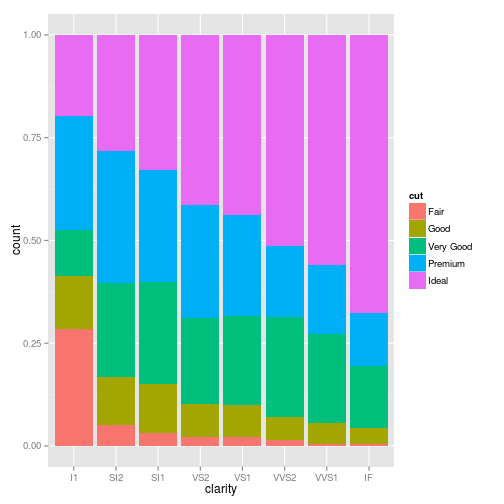
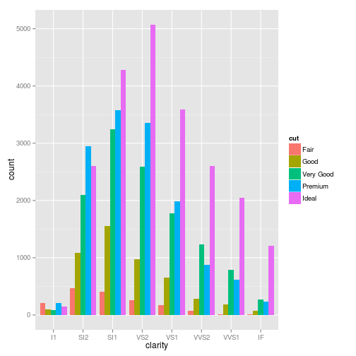

```r
library(ggplot2)
library(base)
head(diamonds)
```

```
##   carat       cut color clarity depth table price    x    y    z
## 1  0.23     Ideal     E     SI2  61.5    55   326 3.95 3.98 2.43
## 2  0.21   Premium     E     SI1  59.8    61   326 3.89 3.84 2.31
## 3  0.23      Good     E     VS1  56.9    65   327 4.05 4.07 2.31
## 4  0.29   Premium     I     VS2  62.4    58   334 4.20 4.23 2.63
## 5  0.31      Good     J     SI2  63.3    58   335 4.34 4.35 2.75
## 6  0.24 Very Good     J    VVS2  62.8    57   336 3.94 3.96 2.48
```

```r
## this homework use varables of 'cut' and 'clarity'
p1 <- ggplot(diamonds, aes(clarity))
## plot bar with position adjustment of fill
p2 <- p1 + geom_bar(aes(y = ..count.., fill = cut), binwidth = 0.1, position = "fill")
## plot bar with position adjustment of stack
p3 <- p1 + geom_bar(aes(y = ..count.., fill = cut), binwidth = 0.1, position = "stack") + 
    scale_y_continuous(breaks = seq(0, 14000, 2000))
## plot bar with position of adjustment dodge
p4 <- p1 + geom_bar(aes(y = ..count.., fill = cut), binwidth = 0.1, position = "dodge")

p3
```

 

```r
p2
```

 

```r
p4
```

 


