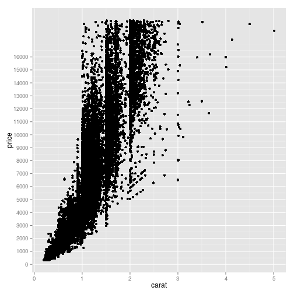

the way to configure y scale


```r
library(ggplot2)
head(diamonds)
```

```
##   carat       cut color clarity depth table price    x    y    z
## 1  0.23     Ideal     E     SI2  61.5    55   326 3.95 3.98 2.43
## 2  0.21   Premium     E     SI1  59.8    61   326 3.89 3.84 2.31
## 3  0.23      Good     E     VS1  56.9    65   327 4.05 4.07 2.31
## 4  0.29   Premium     I     VS2  62.4    58   334 4.20 4.23 2.63
## 5  0.31      Good     J     SI2  63.3    58   335 4.34 4.35 2.75
## 6  0.24 Very Good     J    VVS2  62.8    57   336 3.94 3.96 2.48
```

```r
p <- ggplot(diamonds, aes(x = carat, y = price)) + geom_point()
# png('forumplot1.png')
p
```

 

```r
# dev.off() png('forumplot2.png')
p + scale_y_continuous(breaks = seq(0, 16000, 1000))
```

 

```r
# dev.off()
```


