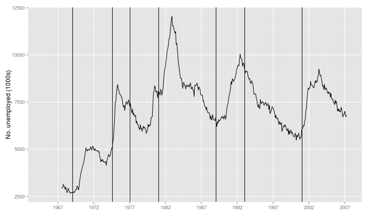
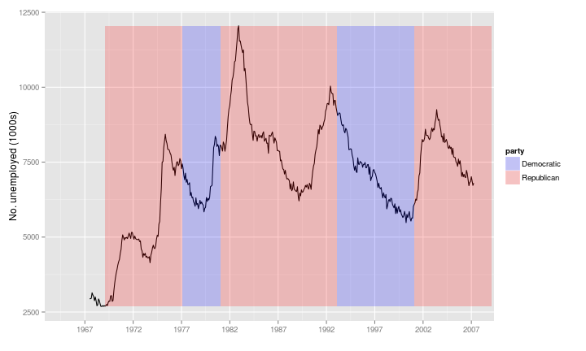
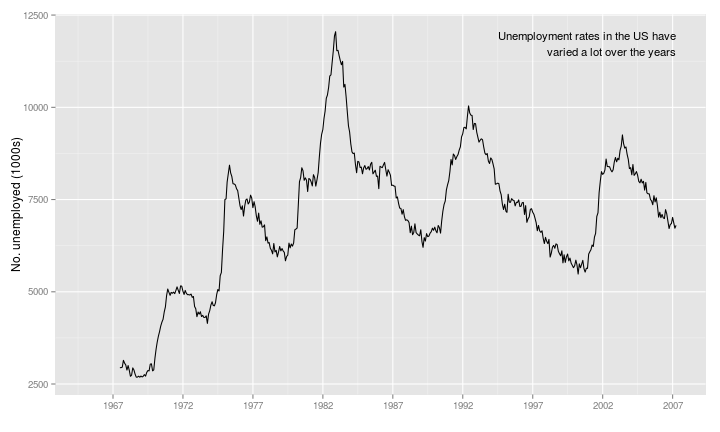
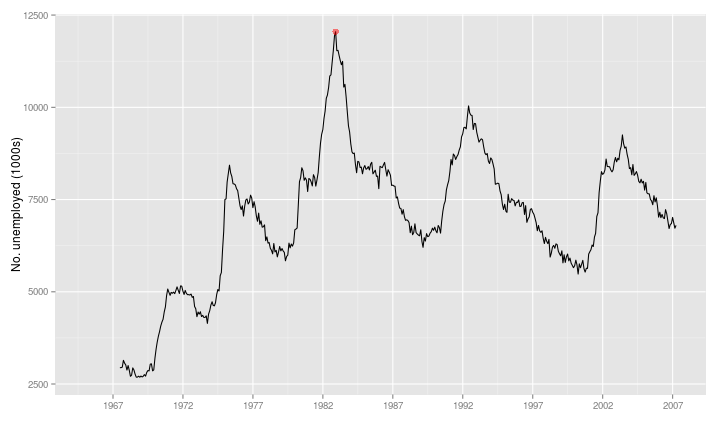
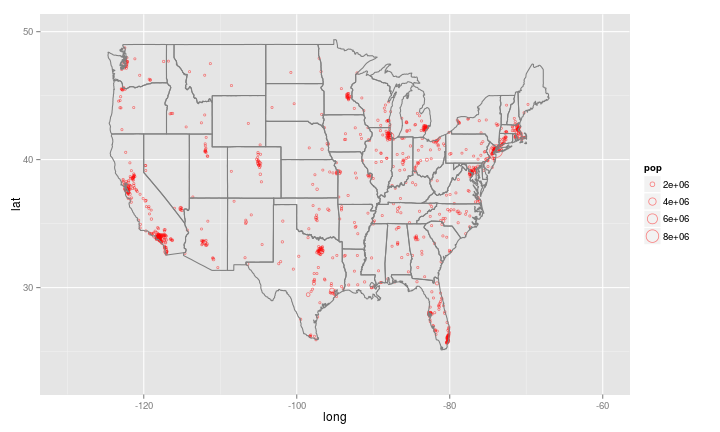

load library


```r
rm(list = ls())
library(ggplot2)
library(scales)
```


original plot


```r
unemp <- qplot(date, unemploy, data = economics, geom = "line", xlab = "", ylab = "No. unemployed (1000s)")
# set the x scale
end <- max(economics$date)
unemp <- unemp + scale_x_date(labels = date_format("%Y"), breaks = date_breaks("5 years"), 
    limits = c(as.Date("1965-1-1"), end))

# load data used to mark
xtable(head(presidential))
```

```
## Error: could not find function "xtable"
```

```r
presidential_part <- presidential[-(1:3), ]
```


mark by the period of typical president with line


```r
yrng <- range(economics$unemploy)
xrng <- range(economics$date)
unemp + geom_vline(aes(xintercept = as.numeric(start)), data = presidential_part)
```

 


mark by the period of typical president with rectangle


```r
unemp + geom_rect(aes(NULL, NULL, xmin = start, xmax = end, fill = party), ymin = yrng[1], 
    ymax = yrng[2], data = presidential_part, alpha = 0.2) + scale_fill_manual(values = c("blue", 
    "red"))  # set blue and red as the color of rectangle
```

 


use text to mark


```r
last_plot() + geom_text(aes(x = start, y = yrng[1], label = name), data = presidential_part, 
    size = 3, hjust = 0, vjust = 0)
```

 


add tex to the plot 


```r
caption <- paste(strwrap("Unemployment rates in the US have varied a lot over the years", 
    40), collapse = "\n")
unemp + geom_text(aes(x, y, label = caption), data = data.frame(x = xrng[2], 
    y = yrng[2]), hjust = 1, vjust = 1, size = 4)
```

 


mark the highest point with red bold point


```r
highest <- subset(economics, unemploy == max(unemploy))
unemp + geom_point(data = highest, size = 3, colour = "red", alpha = 0.5)
```

 


maps


```r
library(maps)
data(us.cities)

cities <- us.cities
xtable(head(cities))
```

```
## Error: could not find function "xtable"
```

```r

# plot the map
```

```r
ggplot(data=cities, aes(long, lat, size=pop)) + 
geom_jitter(color=I("red"), alpha=I(0.5), shape=1) +  # use the size of point to represent the population
xlim(-130, -60) + 
ylim(23, 50) +  
borders("state", size = 0.5)
```

```
## Warning: Removed 4 rows containing missing values (geom_point).
```

 

```r

#tx_cities <- subset(us.cities, country.etc == "TX")
#ggplot(tx_cities, aes(long, lat)) +
#borders("county", "texas", colour = "grey70") +
#geom_point(colour = "black", alpha=0.5)
```


