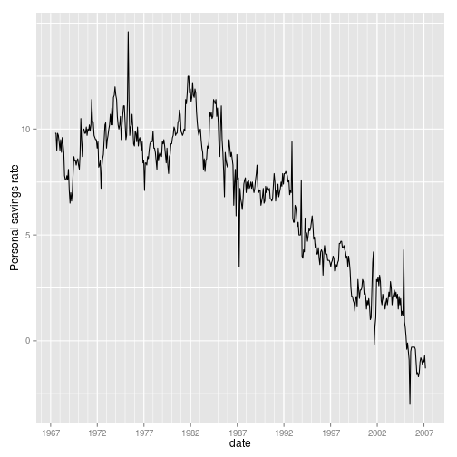
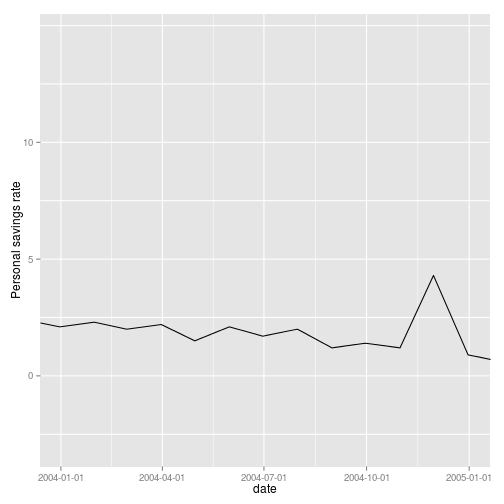
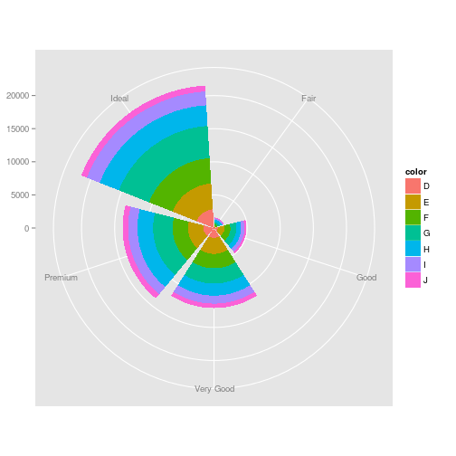
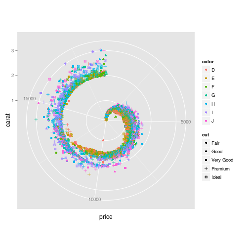

```r
library(ggplot2)
library(scales)
```


1.


```r
plot0 <- qplot(date, psavert, data = economics, geom = "line")
plot0.1 <- plot0 + ylab("Personal savings rate") + # geom_hline(xintercept = 0, colour = 'grey50') +
scale_x_date(labels = date_format("%Y"), minor_breaks = date_breaks("1 years"), 
    breaks = seq(as.Date("1967-1-1"), as.Date("2007-2-1"), 5 * 366))

plot1 <- plot0.1 + theme(panel.grid.minor = element_line(color = "white"), panel.grid.minor.y = element_line(size = 0.5, 
    color = "white")) + scale_y_continuous(breaks = c(0, 5, 10))

plot1
```

 

```r

plot2 <- plot1 + scale_x_date(labels = date_format("%Y"), minor_breaks = date_breaks("1 years"), 
    breaks = seq(as.Date("1967-1-1"), as.Date("2007-2-1"), 10 * 366))
```

```
## Scale for 'x' is already present. Adding another scale for 'x', which will replace the existing scale.
```

```r

plot2
```

 

```r

plot3 <- plot2 + scale_x_date(limits = as.Date(c("2004-1-1", "2005-1-1")), labels = date_format("%Y-%m-%d"), 
    breaks = as.Date(c("2004-1-1", "2004-4-1", "2004-7-1", "2004-10-1", "2005-1-1")))
```

```
## Scale for 'x' is already present. Adding another scale for 'x', which will replace the existing scale.
```

```r

plot3
```

 


2.


```r
head(diamonds)
```

```
##   carat       cut color clarity depth table price    x    y    z
## 1  0.23     Ideal     E     SI2  61.5    55   326 3.95 3.98 2.43
## 2  0.21   Premium     E     SI1  59.8    61   326 3.89 3.84 2.31
## 3  0.23      Good     E     VS1  56.9    65   327 4.05 4.07 2.31
## 4  0.29   Premium     I     VS2  62.4    58   334 4.20 4.23 2.63
## 5  0.31      Good     J     SI2  63.3    58   335 4.34 4.35 2.75
## 6  0.24 Very Good     J    VVS2  62.8    57   336 3.94 3.96 2.48
```

```r
p4 <- ggplot(diamonds, aes(x = cut, fill = color))
p4 + labs(x = NULL, y = NULL) + geom_bar(aes(y = ..count..)) + coord_polar()
```

 

```r

part_diamonds <- subset(diamonds, clarity == "SI2")
p5 <- ggplot(part_diamonds, aes(x = price, y = carat, color = color, shape = cut))
p5 + labs(x = "price", y = "carat") + geom_point() + coord_polar()
```

 


